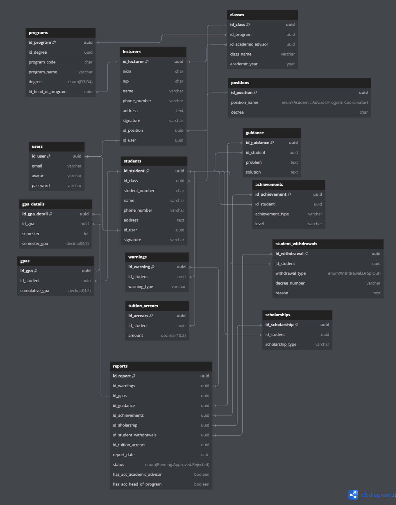
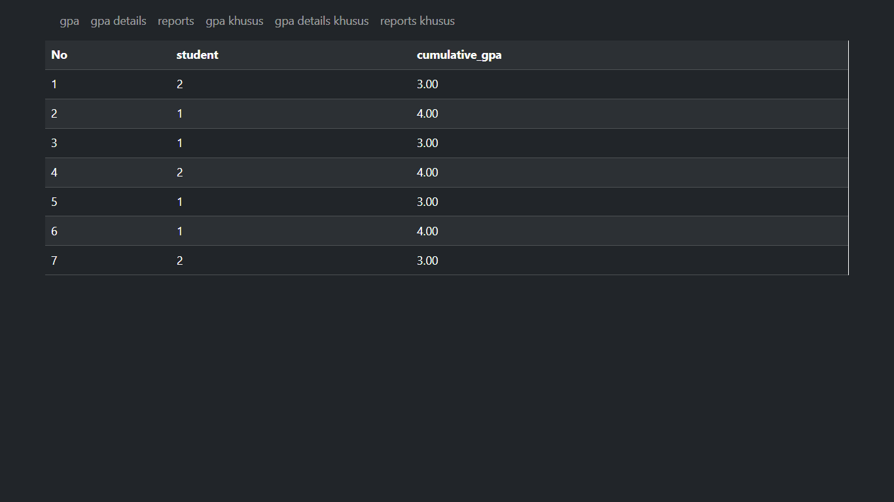
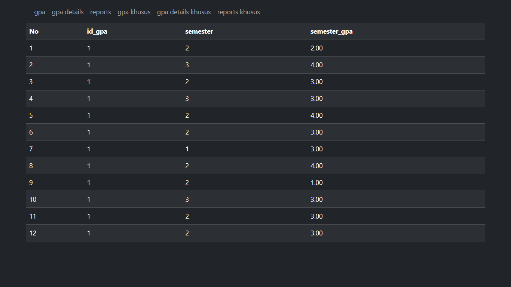
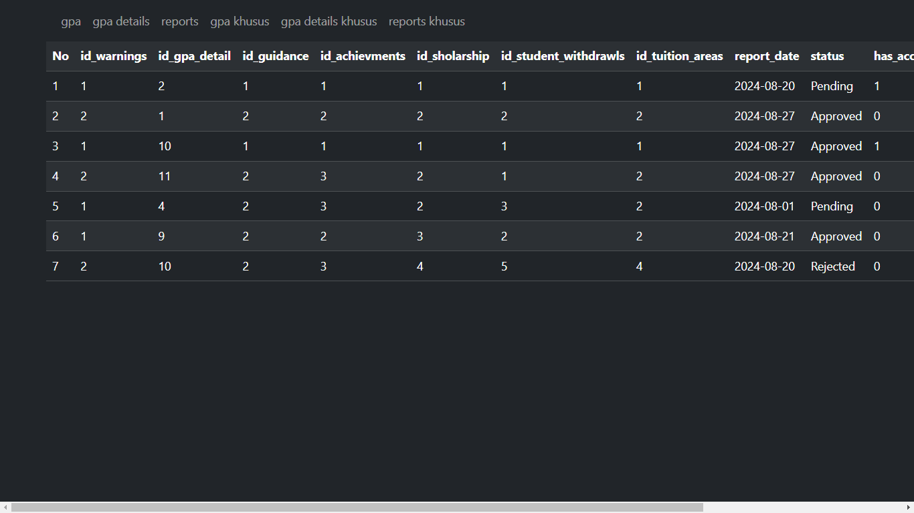
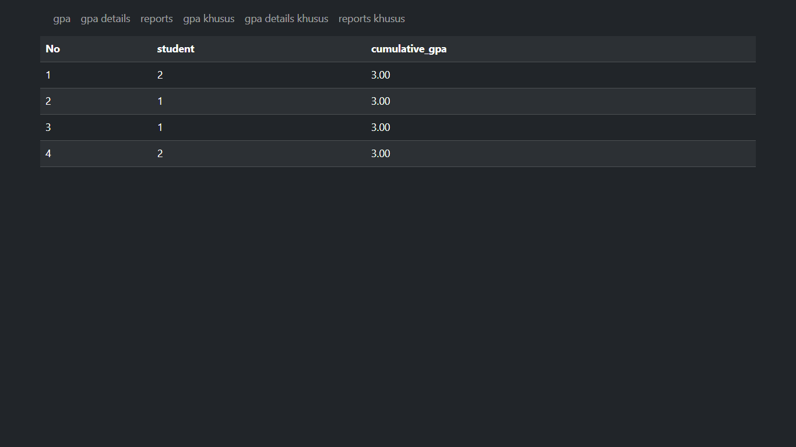
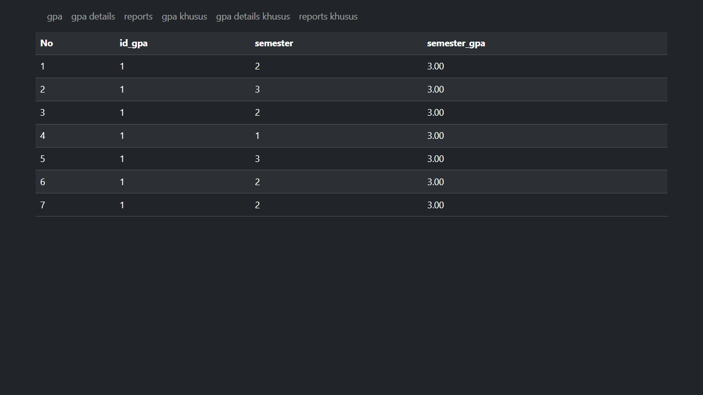
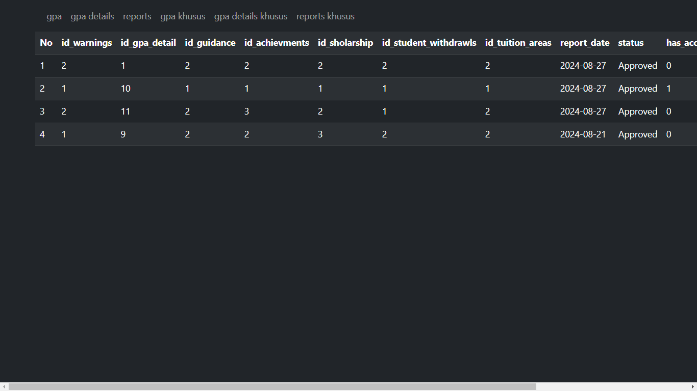

# Tugas 2 Praktikum Pemrograman Web
## Tentang saya 
Nama : Yonan Prasetyo \
Kelas : TI-2A \
NIM : 230102023 
-
## Overview
Sistem Informasi Bimbingan Akademik JKB (SIWALI JKB) adalah sistem manajemen bimbingan akademik yang komprehensif yang dirancang untuk menyederhanakan proses pengelolaan kinerja mahasiswa, konseling, dan data akademik lainnya untuk institusi pendidikan tinggi.
## Task
1. **membuat view berbasis OOP PHP dengan menerima data dari mySQL database (tabel reports, gpas dan gpa_details)**
2. **menggunakan __construct sebagai link untuk menghubungan ke database**
    ```php
    public function __construct(){
        $this->conn = mysqli_connect($this->host, $this->user, $this->pass, $this->db);
    }
    ```
3. **menerapkan encapsulation berdasarkan studi kasus**
    ```php
    private $host = "localhost";
    private $user = "root";
    private $pass = "";
    private $db = "pweb2_tugas2";
    protected $conn;
    
    ```
4. **menggunakan kelas turunan dengan konsep inheritance**
    ```php
    class Koneksi{
        # code
    }

    class Gpas extends Koneksi{
        # code
    }

    class GpasKhusus extends Gpas{
        # code
    }
    ```
5. **menerapkan polymorphiism**
    ```php
    class Gpas extends Koneksi{
        public function tampil_data(){
            # code
        }
    }

    class GpasKhusus extends Gpas{
        public function tampil_data(){
            # code yang berbeda
        }
    }
    ```
## ERD (Entity Relationship Diagram)

## Tampilan Program
+ menampilkan seluruh isi tabel gpas 

+ menampilkan seluruh isi tabel gpa_details

+  menampilkan seluruh isi tabel reports

+  menampilkan isi tabel gpas yang memiliki cumulative_gpa sama dengan 3.00

+ menampilkan isi tabel gpa_details yang memiliki semerter_gpa sama dengan 3.00

+ menampilkan isi tabel reports yang status-nya Approved


